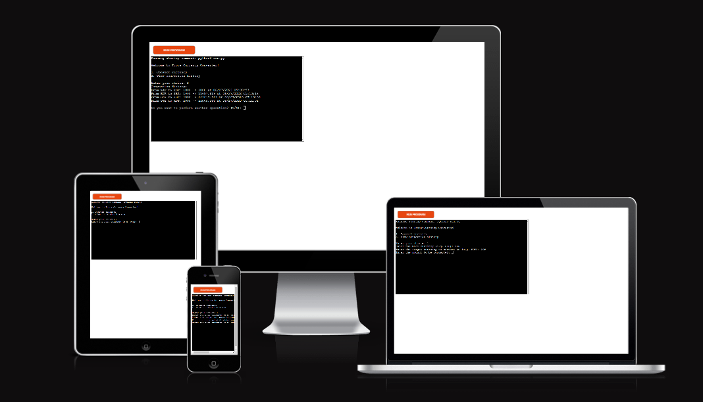
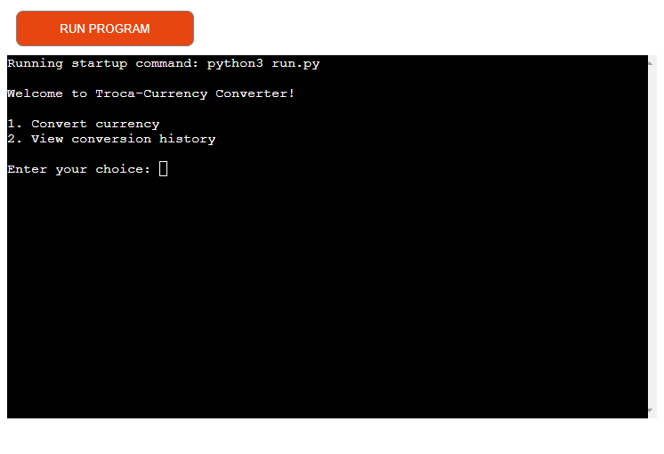
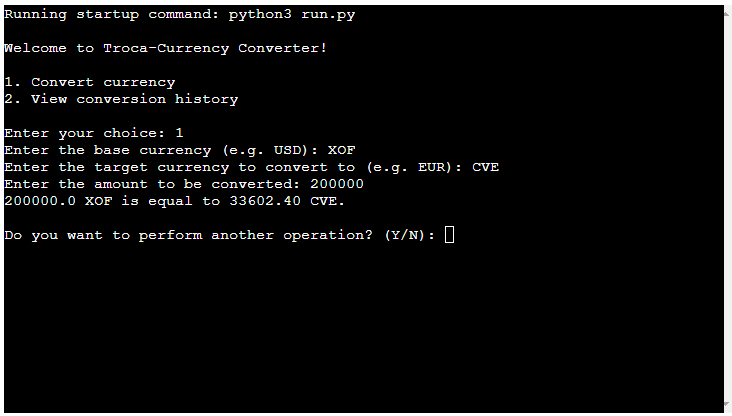

# Troca-Currency

## Overview

Troca-Currency is a Python-based application that enables users to convert currencies using real-time exchange rates from the Google Sheets and alternatively 'exchangerate.host' API. Additionally, the application stores the conversion history in a Google Sheets document, providing an easily accessible log of past conversions with Date and Time of the conversion.

[Here is the live version of the project](https://troca-currency-3e6445701967.herokuapp.com/)



## Usage
Upon running the script, users will be greeted with a main menu where they can choose to convert currency or view conversion history.

When converting currency, users will be asked to input the base currency, the target currency, and the amount to be converted. If the exchange rate is available, the converted amount will be displayed and stored in the 'history' worksheet in the Google Sheets document.

When viewing conversion history, users will see a list of all past conversions, including the base currency, target currency, original amount, converted amount, and the date and time of conversion.


## Features

### Existing Features
- The application asks you to choose between 2 types of services 1 perform a conversion and 2 see the history of past conversions.


- Users can convert any amount from one currency to another using real-time exchange rates.


- Users can view their past conversions, which are stored in a Google Sheets document.


## Data Model
The application's data model consists of two primary data entities, namely the currency codes (String e.g XOF, CVE, EUR, BTC) with their associated exchange rates (Float), and a conversion history Base Currency (String), Target Currency (String), Amount (Float), Converted Amount (Float) and Timestamp (String) of all past conversions. 
The Google Sheets document, with which the application interacts, serves as the database. It contains separate worksheets for the currency codes with their exchange rates, and the conversion history.

## Future Improvements
- Allow users to delete conversion history.

## Testing

**Problem**
During the mentoring section with my Mentor Cans we conducted tests together to see how the code was working. 
In my original implementation, i provided the user with a choice between two options:

    1. Convert currency
    2. view conversion history

- The user was then prompted to enter their choice, with the expectation that they would enter '1' or '2'. However, during the testing phase, it was noted that if a user entered any other value (such as a string or a different number), the program printed an "Invalid choice, please select 1 or 2" message. Still, it proceeded directly to the next prompt "Do you want to perform another operation?", without giving the user a chance to correct their choice.

- Moreover, when asked "Do you want to perform another operation? (Y/N)", if the user entered any other text than 'Y' or 'N' (for example a string "asss" or an integer "122"), the program ended with the message "Thank you for using Troca-Currency Converter!". The user wasn't given a chance to correct their input.

**Solution:**
- To resolve this issue, i integrated a while True loop around the choice input section. This loop continually prompts the user to make a valid choice until '1' or '2' is entered. If an invalid choice is made, the program will print the "Invalid choice, please select 1 or 2" message and then immediately prompt the user to "Enter your choice:" again, providing them with an opportunity to correct their mistake.
**[Commit](https://github.com/atchutchi/troca-currency/commit/94fbdec4d4fc4c83d48b7590dbf6ad0878b2a76d)**

- For the second issue, the while True loop around the section where the user is asked "Do you want to perform another operation? (Y/N)", ensures that the user must enter either 'Y' or 'N'. If any other input is provided, the user will be notified with an "Invalid input, please enter Y or N" message, and the question will be repeated until a valid input is given.
**[Commit](https://github.com/atchutchi/troca-currency/commit/2e554e7229639056212cd0aea746eb40e005469d)**


### Bugs
- When I was trying to deploy, I got the error below, but the error was the result that after I did the requirements `pip freeze > requirements.txt` my requirements file didn't update I tried to install the request, but it appeared that it was already installed, I tried to use other codes on the internet but I ended up solving it using the help of the Tutor Guide of the Code Institute.

```
traceback (most recent call last):
file "/app/run.py", line 1 in <module> 
import requests
ModuleNotFoundError: No module named 'requests' 
```


### Remaining Bugs
- No Bugs remaining


### Validator Testing
**PEP8CI**
- No error were returned from [pep8ci.herokuapp](https://pep8ci.herokuapp.com/)


## Deployment
This project was deployed using Code Institute's mock terminal for Heroku

- Steps for deployments:
    - Fork on clone this repository
    - Create a new Heroku app
    - Set the buildbacks to Python and NodeJS in order
    - Make a Configuration Vars by adding creds.json
    - Link the Heroku app to the repository
    - Click on Deploy


## Credits

### Content
- Google Sheets based model taken from [ablebits](https://www.ablebits.com/office-addins-blog/currency-conversion-google-sheets/).

### Media
- Screenshot of the responsive where taken from [ui.dev](https://ui.dev/amiresponsive?url=https://troca-currency-3e6445701967.herokuapp.com/).

### Language Used
- Python

### Codes
- API used for conversion currency [exchangerate.host](https://exchangerate.host/#/)
- [Geeksforgeeks Currency Converter in Python](https://www.geeksforgeeks.org/currency-converter-in-python/)
- [Requests:HTTP](https://docs.python-requests.org/en/latest/user/quickstart/#make-a-request)
- Multi-line Docstrings from [Python Docstrings](https://www.geeksforgeeks.org/python-docstrings/)

### Deployment
- Code Institute for the deployment terminar