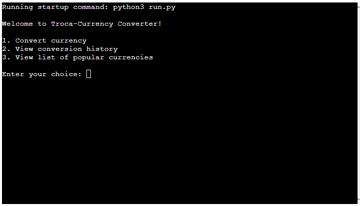
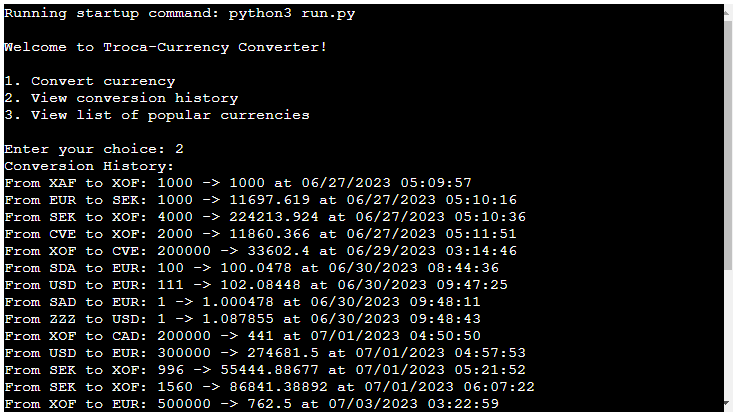

# Troca-Currency

## Overview

Troca-Currency is a Python-based application that enables users to convert currencies using real-time exchange rates from the Google Sheets and alternatively 'exchangerate.host' API. Additionally, the application stores the conversion history in a Google Sheets document, providing an easily accessible log of past conversions with Date and Time of the conversion, and provide the list of popular currencies.

[Here is the live version of the project](https://troca-currency-3e6445701967.herokuapp.com/)


## Usage
Upon running the script, users will be greeted with a main menu where they can choose to convert currency, view conversion history or view list of available currency.

When converting currency, users will be asked to input the base currency, the target currency, and the amount to be converted. If the exchange rate is available, the converted amount will be displayed and stored in the 'history' worksheet in the Google Sheets document.

When viewing conversion history, users will see a list of all past conversions, including the base currency, target currency, original amount, converted amount, and the date and time of conversion.

When you choose view list of popular currencies, the user will receive the complete list of available countries with their currency code.


## Features

### Existing Features
- The application asks you to choose between 3 types of services first perform a conversion, second see the history of past conversions and third view list of available currency.


- Users can convert any amount from one currency to another using real-time exchange rates.


- Users can view their past conversions, which are stored in a Google Sheets document.


- User can request the list of all  list of popular currencies from Google Sheet.


## Data Model
The application's data model consists of two primary data entities, namely the currency codes (String e.g XOF, CVE, EUR, BTC) with their associated exchange rates (Float), and a conversion history Base Currency (String), Target Currency (String), Amount (Float), Converted Amount (Float) and Timestamp (String) of all past conversions. 
The Google Sheets document, with which the application interacts, serves as the database. It contains separate worksheets for the currency codes with their exchange rates, and the conversion history.

## Future Improvements
- Allow users to delete conversion history.

## Testing

### Testing Steps
1. Run the program

    You will see the message "Welcome to Troca-Currency Converter!" printed on the console.
    - The program will present you with the following options:
        Enter '1' to convert currency.
        Enter '2' to view conversion history.
        Enter '3' to view the list of available currencies.

2. Choose option '1' by entering '1' and press Enter.

    - You will be prompted to enter the base currency code (e.g., USD). Enter a valid       three-letter currency code and press Enter.
    - Next, you will be prompted to enter the target currency code (e.g., EUR). Enter a valid three-letter currency code and press Enter.
    - Enter the amount to be converted and press Enter.
    - The program will check if the entered currency codes are valid and whether the exchange rate is available. If any of the codes are invalid or the exchange rate is not available, you will be prompted to re-enter the currency codes.
    

    - If the currency codes are valid and the exchange rate is available, the program will perform the currency conversion and display the converted amount.
    - The conversion will be saved to the history worksheet in Google Sheets.
    - After the conversion, the program will ask if you want to perform another operation, enter 'Y' to perform another operation or 'N' to exit the program. If you enter any other input, you will be prompted to enter a valid input.
    

3. Choose option '2' by entering '2' and press Enter the program will fetch all records from the 'history' worksheet in the Google Sheets document.


4. Choose option '3' by entering '3' and press Enter the program will fetch all records from the 'codes' worksheet in the Google Sheets document.
- The program will print the message "Popular Currencies Exchange:" on the console.


### Testing Bug

**Problem**
During the mentoring section with my Mentor Cans we conducted tests together to see how the code was working. 
In my original implementation, i provided the user with a choice between two options:

    1. Convert currency
    2. view conversion history

- The user was then prompted to enter their choice, with the expectation that they would enter '1' or '2'. However, during the testing phase, it was noted that if a user entered any other value (such as a string or a different number), the program printed an "Invalid choice, please select 1 or 2" message. Still, it proceeded directly to the next prompt "Do you want to perform another operation?", without giving the user a chance to correct their choice.

- Moreover, when asked "Do you want to perform another operation? (Y/N)", if the user entered any other text than 'Y' or 'N' (for example a string "asss" or an integer "122"), the program ended with the message "Thank you for using Troca-Currency Converter!". The user wasn't given a chance to correct their input.

**Solution:**
- To resolve this issue, i integrated a while True loop around the choice input section. This loop continually prompts the user to make a valid choice until '1' or '2' is entered. If an invalid choice is made, the program will print the "Invalid choice, please select 1 or 2" message and then immediately prompt the user to "Enter your choice:" again, providing them with an opportunity to correct their mistake.
**[Commit](https://github.com/atchutchi/troca-currency/commit/94fbdec4d4fc4c83d48b7590dbf6ad0878b2a76d)**

- For the second issue, the while True loop around the section where the user is asked "Do you want to perform another operation? (Y/N)", ensures that the user must enter either 'Y' or 'N'. If any other input is provided, the user will be notified with an "Invalid input, please enter Y or N" message, and the question will be repeated until a valid input is given.
**[Commit](https://github.com/atchutchi/troca-currency/commit/2e554e7229639056212cd0aea746eb40e005469d)**


**Problem**
The original implementation of the code did not handle invalid currency codes properly. When fetching exchange rates using the API, even if an invalid three-letter currency code was entered for the base or target currency, the code defaulted to EUR as the base currency. This allowed the program to continue execution without alerting the user that an invalid currency code was provided.

**Solution**
To address this issue, the following changes were made:

- I Created a new function called get_all_available_currency that utilizes the API (https://api.exchangerate.host/latest?base={base_currency}) to fetch available currency codes relative to the base currency.
- I Add input validation for currency codes in the convert_currency function. The function now checks if the entered base and target currency codes are valid by using the is_valid_currency_code function. If any of the codes are invalid, the program prompts the user to enter valid codes.
**[Commit](https://github.com/atchutchi/troca-currency/commit/08e22f8a9c1329c78a6fe62ec0c683c605e95032)**


### Remaining Bugs
- No Bugs remaining


### Validator Testing
**PEP8CI**
I run the Code Instituite CI Python Linter and appear this results mutliple times:
- E501 line too long (86 > 79 characters)
- W291 trailing whitespace
- W391 blank line at end of file
- E125 continuation line with same indent as next logical line
- E129 visually indented line with same indent as next logical line

I solved them all by using the [How to Write Beatiful Python Code With PEP 8](https://realpython.com/python-pep8/#maximum-line-length-and-line-breaking).
- The Commit showing how it was before and after: [Commit](https://github.com/atchutchi/troca-currency/commit/e47c41b62ce848f26c71d4bc44b83ca5d38b5a1e).

No error were returned from [pep8ci.herokuapp](https://pep8ci.herokuapp.com/)


## Deployment
This project was deployed using Code Institute's mock terminal for Heroku

- Steps for deployments:
    - Fork on clone this repository
    - Create a new Heroku app
    - Set the buildbacks to Python and NodeJS in order
    - Make a Configuration Vars by adding creds.sample.json (obtained on https://console.cloud.google.com/apis/library)
    [Example](./assets/documents/creds_sample.json)
    - Link the Heroku app to the repository
    - Click on Deploy

### Deployment Bugs
- When I was trying to deploy, I got the error below, but the error was the result that after I did the requirements `pip freeze > requirements.txt` my requirements file didn't update I tried to install the `request`, but it appeared that it was already installed, I tried to use other codes on the internet but I ended up solving it using the help of the Tutor Guide of the Code Institute that was able to install properly the `request`

```
traceback (most recent call last):
file "/app/run.py", line 1 in <module> 
import requests
ModuleNotFoundError: No module named 'requests' 
```


## Credits

### Content
- Google Sheets based model taken from [ablebits](https://www.ablebits.com/office-addins-blog/currency-conversion-google-sheets/).
- The Google Sheet used: [the Sheet](./assets/documents/exchange_currency.xlsx).

### Media
- Screenshot of the responsive where taken from [ui.dev](https://ui.dev/amiresponsive?url=https://troca-currency-3e6445701967.herokuapp.com/).

### Language Used
- Python

### Codes
- API used for conversion currency [exchangerate.host](https://exchangerate.host/#/)
- [Geeksforgeeks Currency Converter in Python](https://www.geeksforgeeks.org/currency-converter-in-python/)
- [Requests:HTTP](https://docs.python-requests.org/en/latest/user/quickstart/#make-a-request)
- Multi-line Docstrings from [Python Docstrings](https://www.geeksforgeeks.org/python-docstrings/)
- Write with a proper PEP 8 guidance [Real Python](https://realpython.com/python-pep8/#maximum-line-length-and-line-breaking)

### Deployment
- Code Institute for the deployment terminar

# Mentor
- [Can Sücüllü](https://github.com/cansucullu) were consulted during the development process.